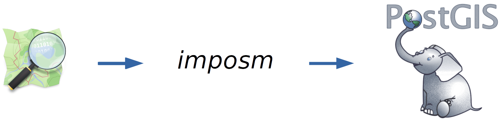
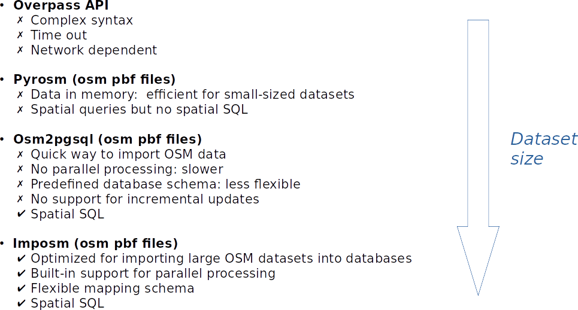

# <span style="color:#66C3FF">Imposm<span>

> Official website: <a href="https://imposm.org/docs/imposm3/latest/">https://imposm.org/docs/imposm3/latest//</a>

Imposm is a command-line _Extract Transform and Load_ (ETL) tool used for __importing OpenStreetMap (OSM) data into PostGIS__ databases efficiently. It is specifically designed to __handle large-scale geospatial datasets__. Imposm performs tasks such as data filtering, simplification, and schema mapping, ensuring that the data is structured appropriately for storage in a PostGIS-enabled PostgreSQL database. Imposm's command-line interface allows users to customize the import process according to their specific requirements, making it a valuable tool for efficiently importing and managing vast volumes of OSM data for geospatial applications.




## <span style="color:#66C3FF">What about other OSM data import tools?<span>

In our context, Imposm stands out as the ideal choice for importing OpenStreetMap (OSM) data into PostGIS based on several key advantages when compared to its competitors:

- __Overpass API__: Imposm has a simpler syntax, avoids timeout issues and network dependency. 
- __Pyrosm__: Imposm is optimized for importing large OSM datasets into databases, while Pyrosm loads data into memory, making it suitable for small datasets but impractical for larger ones. 
- In contrast to __Osm2pgsql__, Imposm offers built-in support for parallel processing, allowing for faster imports, and provides a flexible mapping schema that can be customized according to specific needs. While Osm2pgsql lacks support for incremental updates, Imposm enables the incorporation of changes over time. 

Moreover, Imposm allows for the utilization of Spatial SQL, enabling powerful spatial queries and analysis within the PostGIS environment, providing a comprehensive and efficient solution for handling OSM data at scale.



## <span style="color:#66C3FF">Folder structure<span>

To run the following steps, it is recommended to follow the same structure.

If you cloned or downloaded the github repository (<a href="https://github.com/jerome-urbain/SotMUS25">https://github.com/jerome-urbain/SotMUS25</a>), check that you have the following structure especially for the ```imposm``` folder:

```
.
└── SotMUS25/
    ├── imposm/
    │   ├── docker-compose.yml
    │   ├── mapping/
    │   │   └── mapping.yml
    │   └── osm_data/
    │       └── XX.osm.pbf
    ├── docs
        └──figures
    └── slides
```
__If the ```osm_data``` folder is missing, create it (empty)__. osm.pbf files will be downloaded in the next section.


## <span style="color:#66C3FF">Download data<span>

You can download data in osm.pbf format directly from the geofabrik website (<a href="http://download.geofabrik.de/">http://download.geofabrik.de/</a>). I suggest to start with a small country or state in the following list:

- Andorra: <a href="http://download.geofabrik.de/europe/andorra-latest.osm.pbf">http://download.geofabrik.de/europe/andorra-latest.osm.pbf</a>
- Luxembourg: <a href="http://download.geofabrik.de/europe/luxembourg-latest.osm.pbf">http://download.geofabrik.de/europe/luxembourg-latest.osm.pbf</a>
- South Dakota: <a href="https://download.geofabrik.de/north-america/us/south-dakota-latest.osm.pbf">https://download.geofabrik.de/north-america/us/south-dakota-latest.osm.pbf</a>

 <span style="color:red">__To use the setup defined in this workshop, it is recommended to save these files in the ```imposm/osm_data``` folder such as described in the previous section. If this folder doesn't exist yet, create it.__<span>

## <span style="color:#66C3FF">Filter data during the import with a mapping file<span>

When importing OSM data into PostGIS with Imposm, the ```mapping.yml``` file plays a crucial role. It is used to __define the mapping between OSM data elements (nodes, ways, and relations) and the database schema in PostGIS__. 
Imposm uses this mapping file to determine how OSM data should be stored and organized within the PostGIS database. 

This configuration file contains rules about:

- __Data Transformation__: The ```mapping.yml``` file defines how OSM tags are transformed into database columns. Each OSM tag can be mapped to a specific column in one or more database tables. For example, OSM tags like "highway" or "name" can be mapped to corresponding columns in the database schema.

- __Schema Definition__: It defines the structure of the PostGIS database schema. For instance, it specifies which tables should be created for nodes, ways, and relations, and what columns these tables should contain. The file also defines the data types for each column (e.g., text, integer, geometry).

- __Geometry Types and Coordinates__: For spatial data like points, lines, and polygons, the ```mapping.yml``` file specifies how OSM node coordinates are transformed into geometries. It defines the geometry type (Point, LineString, Polygon) and the coordinate columns (usually "lon" and "lat" for longitude and latitude).

- __Relations__: OSM data often contains relationships between elements. The ```mapping.yml``` file defines how these relations should be represented in the database, allowing for the creation of tables to store these relationships.

- __Advanced Mapping__: The file supports more advanced configurations, such as applying filters based on OSM tags, conditional mapping (mapping certain tags only if certain conditions are met), and handling complex geometries.

By providing a clear and customizable mapping between OSM data and the database schema, the ```mapping.yml``` file allows Imposm to accurately import OSM data into PostGIS, ensuring that the data is properly structured, organized, and ready for spatial queries and analysis within the PostgreSQL database.


Here is a simple mapping file directly inspired by the official imposm3 documentation (<a href="https://imposm.org/docs/imposm3/latest/mapping.html">https://imposm.org/docs/imposm3/latest/mapping.html</a>).
This configuration allows to creates a ```road``` table in PostGIS to store linear geometries (linestring) related to any OSM data tagged as ```highway``` (of any type).

```yaml
tables:
  road:
    type: linestring
    mapping:
      highway: [__any__]
      #highway: [path, track, unclassified]
    columns:
    - {name: osm_id, type: id}
    - {name: geom, type: geometry}
    - {key: name, name: street_name, type: string}
    - {key: bridge, name: is_bridge, type: bool}
    - {name: highway_type, type: mapping_value}
```

Note that some mapping rules are applied on attributes to define the columns of the ```road``` table:

- a column named ```osm_id``` of type ID is created to store the unique identifier of the OSM element.
- a column named ```geom``` of type geometry is created to store the LineString geometries.
- a ```street_name``` column of type string is created and mapped from the OSM tag with key ```name```. This allows storing street names.
- a column named ```is_bridge``` of type _boolean_ is created and mapped from the OSM tag with key ```bridge``` to indicate whether the road is a bridge or not.
- a column named ```highway_type``` of a custom type _mapping_value_ is created to store the specific values of the ```highway``` tag (_path, track, unclassified, etc._).

You can also see that there is a commented line to show you what would be this line for specific highway types such as _path, track and unclassified_. If you want to use this filter on highway types you can replace the previous line (containing ```__any__```) with it.


Note that an OSM element is only inserted once even if a mapping matches multiple tags.


## <span style="color:#66C3FF">Imposm docker image<span>

To skip the imposm installation only available on linux, you can directly pull an existing imposm docker image released by the GeoPostcodes team:
```bash
docker pull geopostcodes/imposm:1.2
```

With this docker image you have a ready to use imposm setup in only few seconds! It's pretty cool, isn't it?

```{warning}
IMPORTANT NOTE:
If we instantiate this image and create a container based on it, the container will not be able to communicate with the PostGIS container we created before because they are isolated by default (container principle). They would not be in the same network. 
In consequence, they cannot communicate together and you cannot reach the PostGIS container from the imposm one, which makes OSM data import impossible based on this setup. Be patient, we will solve this issue in the next section!
```