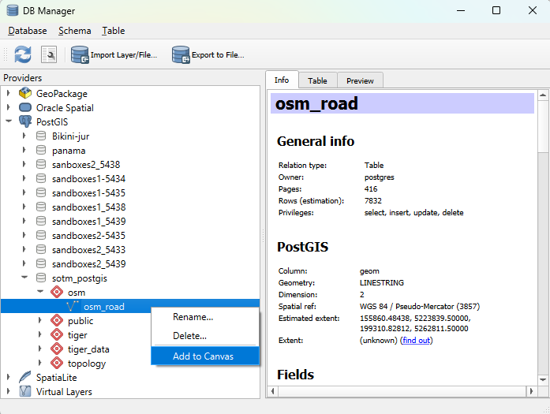
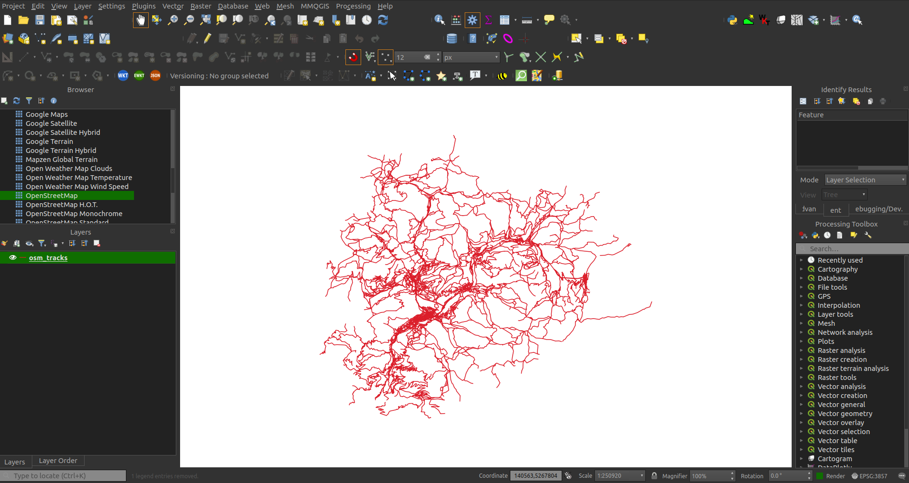
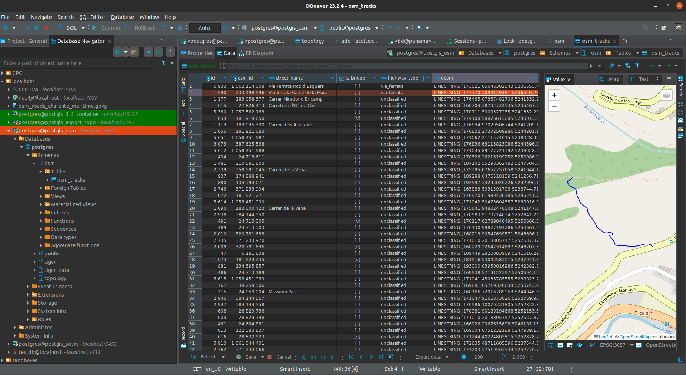

# <span style="color:#66C3FF">Query data stored in PostGIS<span>

Depending on your setup, you can browse or query the OSM data which are now stored in PostGIS.

It is now time to take advantage of having the data in a PostgreSQL database!


## <span style="color:#66C3FF">Read table with QGIS<span>
```{note}
NOTE:
Due to the different possible setups tested during the preparation of this workshop, layers/tables/attributes name can differ between the screenshots and what you have on your laptop but the procedure is similar.
```

If you want to read your data stored in PostGIS, you can use the following steps in QGIS menus:

_Database menu_ > _DB Manager_ > _Postgis_ > _[Your_connection_name]_ > _[osm_schema_name]_ > _[osm_table_table]_ > Right click on _[osm_table_table]_ > _Add to canvas_




Your data should now be loaded as a vector layer into QGIS map canvas:


Feel free now to add an OpenStreetMap XYZ tiles basemap and play with the properties of the layer!
Why not applying a categorized symbology based on the highway_type attribute for example?

## <span style="color:#66C3FF">Browse and query table in DBeaver<span>




```{warning}
By default these data are stored in "Web Mercator" coordinates system (EPSG 3857).
All the measures are then based on the "mercator meter" unit. If you want more accurate results, don't hesitate to transform the data in a more adequate/relevant projection considering your area of interest.
```

## <span style="color:#66C3FF">Query 1: 10 longuest roads<span>

```sql
-- top 10 longest roads:
select  round(ST_Length(r.geom)) length, r.*
from osm.osm_road r
order by ST_Length(r.geom) desc 
limit 10
```

## <span style="color:#66C3FF">Query 2: number of roads per type<span>

```sql
select count(*), highway_type 
from osm.osm_road r
group by highway_type
order by 1 desc;
```


If you are interested by the proportion of each highway type (based on the number of roads, not their length!), you can compute the percentages per type:
```sql
with total as ( select count(*) nb from osm.osm_road r )
select 
	count(r.*) as nb_road, 
	round(100 * count(r.*)::numeric / t.nb::numeric, 2) as percentage, 
	r.highway_type 
from osm.osm_road r, total t
group by r.highway_type, t.nb
order by 1 desc; 
```

## <span style="color:#66C3FF">Query 3: km of roads per type<span>

```sql
select r.highway_type, sum(ST_Length(r.geom)) / 1000 as km
from osm.osm_road r
group by r.highway_type
order by 2 desc;
```

## <span style="color:#66C3FF">Going further<span>

This workshop is limited to these basic queries but don't hesitate to add other geospatial data and modify the current setup to run spatial queries between layers.

Some examples:

- add a municipalities table and compute the number of pedestrian road/tracks per municipality
- evaluate the connectivity between municipalities by extracting the roads connecting them and build a graph of it
- identify incomplete OSM features in your area to plan your next contribution
- ...


## <span style="color:#66C3FF">Homework exercise<span>
Can you compute the number of buildings within each Zip code area in Massachusetts?

Adapt the code we've developed so far to:

1. Import the Massachusetts data from OSM (<a href="https://download.geofabrik.de/north-america/us/massachusetts.html">https://download.geofabrik.de/north-america/us/massachusetts.html</a>)
2. Upload the buildings from OSM instead of the roads (mapping.yml)
3. Download the ZCTA shapefiles: <a href="https://www.census.gov/cgi-bin/geo/shapefiles/index.php?year=2020&layergroup=ZIP%20Code%20Tabulation%20Areas">https://www.census.gov/cgi-bin/geo/shapefiles/index.php?year=2020&layergroup=ZIP%20Code%20Tabulation%20Areas</a>
4. Import the ZCTA polygons within your PostGIS database. Several options here
	- import them from QGIS
	- better: create another docker container including the shp2pgsql utility
	- alternative: add shp2pgsql to your PostGIS container
5. Write a query to count the number of buildings within each Zip code area (! the projection systems of the 2 sources are different, so you will need to convert one of them)
6. Follow-up: categorize building types (residential, commercial, industrial, ...) and count the proportion of each type per zip code area

